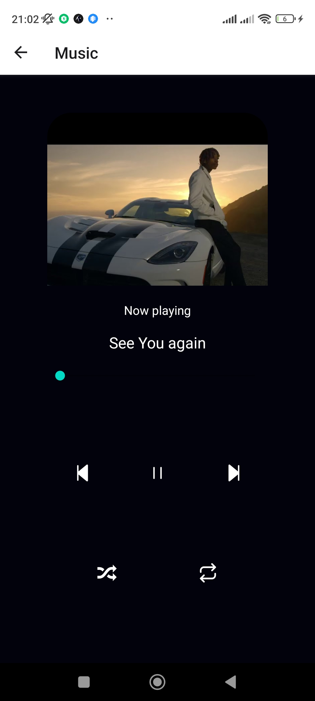
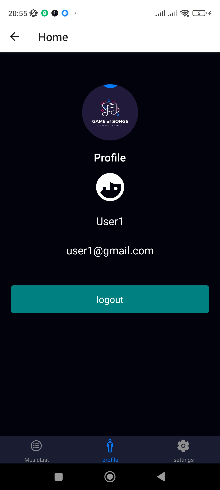
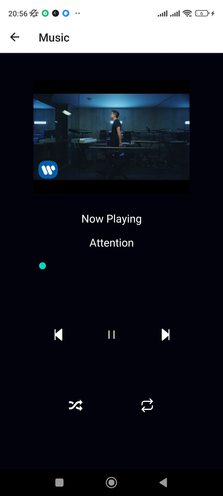

# react native music app using expo

This is a music app with play , pause , next , previous functionality 

           
# react native music app using expo -  https://drive.google.com/file/d/17S4Pfy471-Y_inzG1T7zHXR_J995Ac9B/view?usp=sharing

It includes the following: 

The project goal was to build a music app using React Native and Expo. The app required a login page, a home page to display a list of songs, a song playing screen, and additional tabs for profile and settings. 

Technology : expo , expo av for audio control , toastify , asyncstorage , icons , navigation etc .

### for run the project 
 - npm i
 - expo start
